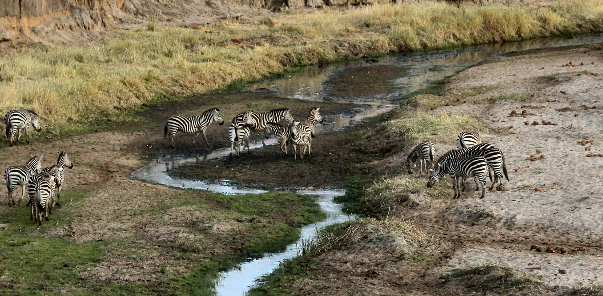

# Source of the article with publication and word count 

Source of the article: https://www.bbc.com/news/science-environment-54091048

Date: 10 September 2020

Word count: 719 

# Vocabulary

|     Word from the   text    |     Synonym/explanation in English                                                           |     French translate      |
|-----------------------------|----------------------------------------------------------------------------------------------|---------------------------|
|     To warn                 |     Inform someone in advance of a possible danger.                                          |     Avertir / Prévenir    |
|     Rate                    |     A measure, quantity, or frequency.                                                       |     Un taux               |
|     Freefall                |     A rapid decline that cannot be stopped.                                                  |     Chute   libre         |
|     Overfishing             |     Excessive fishing                                                                        |     Surpêche              |
|     Wrecking                |     The action of causing the destruction of a ship.                                         |     Naufrage              |
|     Undoubtedly             |     Without doubt; certainly.                                                                |     Indubitablement       |
|     Threaten                |     Cause to be vulnerable or at risk; endanger.                                             |     Menacer               |
|     A stark reminder        |     A strong remind about a fact.                                                            |     Un rappel   brutal    |
|     Anthropocene            |     Relating to or denoting the current geological age.                                      |     Anthropocène          |
|     Fore                    |     Situated or placed in front.                                                             |     En avant              |
|     The supply side         |     The part of a country's economy that involves producing goods and supplying services.    |     Côté de   l’offre     |

# Analysis of the study

- Researchers? 
    + The Zoological Society of London (ZSL)
    + WWF
    +The International Union for Conservation of Nature (IUCN)

- Published in? when (if mentioned)?
    + BBC News, 10 September 2020 

- General topic
    + The wildlife population is in freefall, one million species are threatened by extinction. 
- Procedure/what was examined
    + They looked at thousands of different wildlife species monitored by conservation scientists in habitats across the world and they made a report of whether populations of wildlife are going up or down. 
    
- Conclusions/ discovery
    + The wildlife population is in decline, a lot of species could disappear, one million species are threatened with extinction, some within decades if we cannot change our way to live.   

- Remaining questions ? 
    + /
