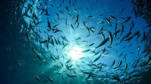

# Source of the article with publication and word count 

Source of the article: https://www.theguardian.com/environment/2020/oct/29/global-heating-threatens-uk-wildlife-ability-adapt-survive-rewilding-britain

Date: 29 October 2020

Word count: 755 

# Vocabulary

|     Word from the text    |     Synonym/explanation in English                                                                                                                                     |     French translate            |
|---------------------------|------------------------------------------------------------------------------------------------------------------------------------------------------------------------|---------------------------------|
|     Shifting              |     Move or cause to move from one place to another.                                                                                                                   |     Déplacement                 |
|     Outpace               |     To move, develop, rise, or improve faster than someone or something else.                                                                                          |     Dépassant                   |
|     Elsewhere             |     Some other places.                                                                                                                                                 |     Autre part                  |
|     Rewilding             |     Restore to its natural uncultivated state an area or a land in order to the reintroduction of species of wild animal that have been driven out or exterminated.    |     Réensauvagement             |
|     Kick-start            |     To start                                                                                                                                                           |     Démarrer                    |
|     Thrive                |     Grow or develop in wellness.                                                                                                                                       |     Prospère                    |
|     Retreat               |     An act of moving back or withdrawing.                                                                                                                              |     Retraite/Recul              |
|     Suitable              |     Something appropriate for a particular person, purpose, or situation.                                                                                              |     Adapté                      |
|     Missmatch             |     Match unsuitably or incorrectly to something.                                                                                                                      |     Décalage                    |
|     Saltmarshes           |     An area of coastal grassland that is regularly flooded by seawater (explained the   salt).                                                                         |     Marais salants              |
|     Livelihoods           |     The minimum (of resources) to live/survive.                                                                                                                        |     Moyen d’exister/subsiter    |
|     Framework             |     The structure of a system or concept.                                                                                                                              |     Cadre                       |
|     Pledge                |     A promise, undertaking to someone.                                                                                                                                 |     Gage                        |
|     Moorland              |     An area of moor (a tract of open uncultivated upland, generally covered by heather).                                                                               |     Landes                      |

# Analysis of the study

- Researchers? 
    + Rewilding Britain 
    + Intergovernmental Panel on Climate Change (IPCC)

- Published in? when (if mentioned)?
    + 29 October 2020  

- General topic
    + The marine’s species (and other terrestrial) of English waters are shifting by climatic changes.

- Procedure/what was examined
    + They observed the living zone of a lot species (marine species, mammals, carnivorous mammals, butterflies, zooplankton, …) and the scientists analyzed the moving of species across the country. They also looked the evolution of the living zone of species like the warming waters.
    
- Conclusions/ discovery
    + The speed at which species must migrate to stay in the same climate zone is 5km a year on UK land and at least 10km a year in UK seas. On land, while mammals such as deer have been shown to move at 9km a year and carnivorous mammals by 6km a year, rodents are less mobile, less than 1km a year. Researchers have also observed a mismatch between zooplankton blooms in the North Sea and the breeding times of seabirds, as well as the ability of young cod to survive. All of this data indicate that wildlife is moving to the north because climatic changes upset the living zone of this species.    

- Remaining questions ? 
    + /

