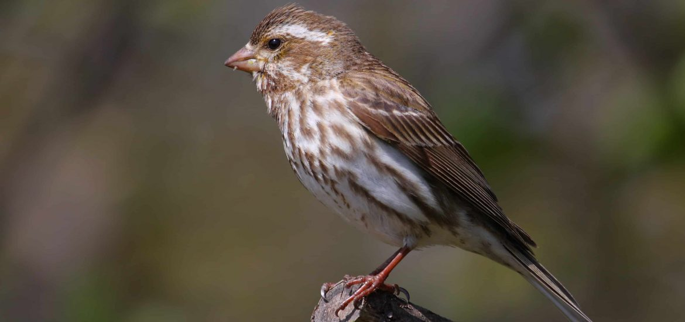

# Source of the article with publication and word count 

Source of the article: : https://www.sciencedaily.com/releases/2020/08/200814131023.htm 

Date: 14 August 2020

Word count: 639 

# Vocabulary 

|     Word from the text    |     Synonym/explanation in English                                                                         |     French translate       |
|---------------------------|------------------------------------------------------------------------------------------------------------|----------------------------|
|     Overall               |     Generally / in general                                                                                 |     En général             |
|     Grassland             |     A large open area of country covered with grass. Generally used for livestock.                         |     Prairie                |
|     Dwindle               |     Reduce gradually in size, amount, or strength.                                                         |     Diminuer               |
|     Pest                  |     Insect, animal or other things that attacks and destroy crops, food, livestock, etc…                   |     Animale nuisible       |
|     Numerous              |     Many                                                                                                   |     Nombreux               |
|     Scale                 |     Relationship between and its representation on the map; proportion (of a reduced model, of a plan).    |     Echelle/barème         |
|     Crop                  |     An area to grown especially a cereal, fruit, or vegetable grown on a large scale commercially.         |     Culture                |
|     Acreage               |     The surface of an area.                                                                                |     Superficie             |
|     County                |     A territorial division of a countries.                                                                 |     Comté / département    |
|     Compelling            |     An argument or a fact that put someone to valid a certain point of view.                               |     Convaincant            |
|     Far-reaching          |     Having great and important effects or implications to a cause or someone.                              |     D’une grande portée    |
|     Distinguished         |     Very successful, authoritative, and commanding great respect.                                          |     Distingué              |

# Analysis of the study

- Researchers? 
    + University of Illinois College of Agricultural 
    + Consumer and Environmental Sciences  

- Published in? when (if mentioned)?
    + 14 August 2020

- General topic
    + The bird population in the US (mainly into grassland) is in the rapid decline, probably caused by using a pesticide called neonicotinoid. 
    
- Procedure/what was examined
    + During a seven-year time period (from 2008 to 2014), they analyzed bird populations in relation to changes in pesticide use and agricultural crop acreage. The scientists using data from hundreds of bird species across the US in four different categories (grassland birds, non-grassland birds, insectivores, and non-insectivores). 
They also examined whether intensified agricultural production and conversion of grassland to agricultural land also contributed to the bird decline. 
    
- Conclusions/ discovery
    + They found robust evidence of the negative impact of neonicotinoids, in particular on grassland birds, and to some extent on insectivore birds even if the effect of neonicotinoids could result directly from birds consuming treated crop seeds, and indirectly by affecting the insect populations they feed on.
The search shows a 2.2% decline in populations of grassland birds and 1.6% in insectivorous birds with an increase of 100 kilograms in neonicotinoid usage per county, to compare to other pesticide the neonicotinoids is more dangerous for birds. 
    
- Remaining questions ? 
    + /

