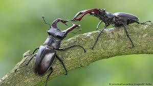

# Source of the article with publication and word count 

Source of the article:https://www.nationalgeographic.com/animals/article/studies-confirm-alarmiang-insect-decline 

Date: 11 January 2021

Word count: 1079 

# Vocabulary

|     Word from the text    |     Synonym/explanation in English                                                    |     French translate        |
|---------------------------|---------------------------------------------------------------------------------------|-----------------------------|
|     Vanish                |     The complete disparition of someone or something.                                 |     Disparition             |
|     Supply                |     Make a product available to someone.                                              |     Alimenter/fournir       |
|     Crawling on           |     Move with specific movement on the ground, that’s how you travel.                 |     Ramper                  |
|     Burrowing             |     When the animal makes holes or tunnels, in order to use it as a dwelling.         |     Enfouissement           |
|     Flourishing           |     When a population or something else is in quickly and successfully developing.    |     Florissant              |
|     Collapse              |     Structure, person or organization in critical falling down.                       |     Effondrement            |
|     Struggling            |     Obtain, accomplish or attain a goal in face some difficulties.                    |     En difficulté           |
|     Endorse               |     Declare (publicly) our approval or support of.                                    |     Approuver               |
|     Lawn                  |     Area with grasse, generally in the garden.                                        |     Pelouse                 |
|     Midst                 |     In the middle of something or the middle part.                                    |     Milieu                  |
|     Stepping-up           |     A big increase.                                                                   |     Intensifier             |
|     Fate                  |     A destined future outside the person control.                                     |     Destin                  |
|     Starkly               |     Brutally.                                                                         |     Brutalement             |
|     Widespread            |     Found easily, in a large proportion.                                              |     Répendu                 |
|     Backyard              |     Garden.                                                                           |     Jardin                  |
|     Encounter             |     To be unexpectedly faced of something or someone.                                 |     Affronter               |
|     Overstated            |     Exagerate.                                                                        |     Exagérer                |
|     Grim                  |     Something doesn’t make you feel happy.                                            |     Triste                  |
|     Assement              |     Evaluation.                                                                       |     Estimation              |
|     Whammy                |     An unlucky evenment or condition.                                                 |     Poisse                  |
|     Pledge                |     To make a promise or made an undertaking.                                         |     Promettre/engagement    |

# Analysis of the study

- Researchers? 
    + Christopher A. Halsch, M. Shapiro, A. Fordyce, Chris C. Nice, James H. Thorne, David P. Waetjen, and Matthew L. Forister.

- Published in? when (if mentioned)?
    + 26 October 2020 
    +Proceedings of the National Academy of Sciences (PNAS)

- General topic
    + The numbers of insect are in decline of 2 at 3 percent in a lot of areas but not in all and we can invert the fate of some species.

- Procedure/what was examined
    + In past there has been many studies about the great collapse and the extinction of many species of insect. So, the researchers try to see beyond this alarming inventory by analyzing as much research as possible concerning insects’ current global status.
They try to make much more bridled, careful, critical assessment than previous reports because a lot of studies show extreme losses in particular regions and extrapolating them across the globe.
    
- Conclusions/ discovery
    + The population of insect are effectively in decrease in an alarming rate and we quickly need to change at personal and national scale our way to live, if everyone makes actions, we can change this situation.
But there a lot of exceptions and some species are flourishing in this complicated situation. For example, the gulf fritillary, generally found in southern portions of the U.S is now flourishing in California because people there cultivate its host, the passion vine, a popular ornamental plant, a changing environment caused by human must increases some species.
The scientists also point the fact than we can change the statues of some species in the danger of extinction because a species fate can change rapidly for the better or worse.
     
- Remaining questions ? 
    + /
