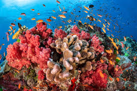

# Source of the article with publication and word count 

Source of the article: https://news.un.org/en/story/2020/12/1080582 

Date: 22 December 2020

Word count: 555 

# Vocabulary

|     Word from the text    |     Synonym/explanation in English                                                                                         |     French translate      |
|---------------------------|----------------------------------------------------------------------------------------------------------------------------|---------------------------|
|     Bleach                |     Something becomes white or much lighter maybe cause by a chemical, biological process   or by exposure to sunlight.    |     Blanchir              |
|     Expel                 |     Force out something from your body.                                                                                    |     Expulser              |
|     Wherein               |     In which.                                                                                                              |     Dans lequel           |
|     Dire                  |     Situation, state extremely serious or urgent.                                                                          |     Terrible              |
|     Reefs                 |     A ridge of jagged rock or coral, generally just above or below the surface of the sea.                                 |     Récifs                |
|     Reprieve              |     Give more time before the punishment or postpone it.                                                                   |     Accorder un sursis    |
|     Keep up               |     Sustain.                                                                                                               |     Se maintenir          |
|     Sustain               |     Continue an action with the same intensity.                                                                            |     Maintenir             |
|     Algae                 |     Typically, an aquatic plant, with the characteristics of vascular plants.                                              |     Algues                |
|     Improve               |     Make something or action better.                                                                                       |     Améliorer             |
|     Spread                |     A process of expansion across an area.                                                                                 |     Se propager           |

# Analysis of the study

- Researchers? 
    + UNEP (UN environment programme)

- Published in? when (if mentioned)?
    + 25 November 2020  

- General topic
    + The coral reefs will disappear led by the coral bleaching (caused by a non-symbiose with microscopic algae). The spread of the coral bleaching must cause by climate change.

- Procedure/what was examined
    + The scientists analyzed the link between the climate change and the phenomena of bleaching. They particularly looked the adaptations and reaction of corals by small temperature change (the report examines the possibility of these adaptations assuming between 0.25 degree Celsius and 2 degrees Celsius of warming). 
They also made some projections of the evolution of coral populations for the next few years with the data of the study.  
    
- Conclusions/ discovery
    + It is not known exactly how corals acclimate to changing temperatures, but it found that every quarter degree of adaption leads to a possible seven-year delay in projected annual bleaching: that means corals could receive a 30-year reprieve from severe bleaching if they can adapt to 1 degree Celsius of warming.
The report offers two scenarios, the first case (the worst) scenario if we continue to use fossils energy and the second scenario if we contribute to reduce 50 percent of our carbon production. In the first case every one of the world’s reefs will bleach by the end of the century and the delayed effects makes worst it, when we look the past report we see the progression of bleaching is ahead of nine years.  
     
- Remaining questions ? 
    + How corals reefs are truly and specificly affect with the warming of the seas?
