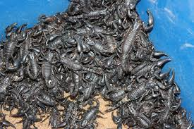

# Source of the article with publication and word count 

Source of the article: https://www.sciencedaily.com/releases/2021/03/210310122605.htm  

Date: 10 March 2021

Word count: 706 

# Vocabulary

|     Word from the text    |     Synonym/explanation in English                                                       |     French translate    |
|---------------------------|------------------------------------------------------------------------------------------|-------------------------|
|     Harvest               |     The process of gathering in farm or animal farm.                                     |     Récolte             |
|     Involve               |     Participate to an activity or situation.                                             |     Impliquer           |
|     Subdue                |     Bring something under our control by force or another way.                           |     Maitriser           |
|     Prey                  |     An animal that is hunted and killed by another generally for food.                   |     Proie               |
|     Despite of            |     In spite of.                                                                         |     En dépit de         |
|     Harmless              |     Something inoffensive, not able to make hurt to someone else.                        |     Inoffensif          |
|     Husbandry             |     Farming.                                                                             |     Agriculture         |
|     Endangered            |     Species in danger of extinction.                                                     |     En danger           |
|     Unsustainable         |     The current rate or level is not able to be maintained at this kind of situation.    |     Insoutenable        |
|     Sufficiently          |     An adequate degree, not too much and not too little.                                 |     Suffisament         |
|     Mapping               |     Associate each element about a domain and connect to other elements.                 |     Cartographie        |
|     Trade                 |     Dealing.                                                                             |     Commerce            |
|     Shine                 |     Make the light on something.                                                         |     Briller             |
|     Poorly                |     Insufficient information or quantities.                                              |     Pauvrement          |

# Analysis of the study

- Researchers? 
    + The researchers of the Biodiversity Unit at the University of Turku.

- Published in? when (if mentioned)?
    + 5 March 2021  

- General topic
    + The trade of scorpions for their venom is in increased, this led to a vast number of scorpions are harvested from nature for commerce and farm. This traffic is endangering the future of several scorpion species in a number of areas by overexploitation of scorpions for their venom.

- Procedure/what was examined
    + The first problem to stopping the endangered of scorpions is our understanding of her. The information about scorpion’s species is very poor. So, the first works of the scientist is to mapping out species in poorly documented areas in order to produce more information about unknow species to bring a better comprehension of the causes and facts about the specie’s extinction.  
    
- Conclusions/ discovery
    + The harvest of scorpion’s venom will bring quickly 
many species to the list of endangered species, million different species will be in this situation in the next decades if the illegal trade development is not slowed down.
The population growth and the related unsustainable overexploitation of natural resources as well as overharvest/trade might cause this several decline, especially species with a small range.
If a lot of species become extinct, we also lose all the possibilities that their complex venoms could offer, for example, to drug development and other possibilities.
     
- Remaining questions ? 
    + /
