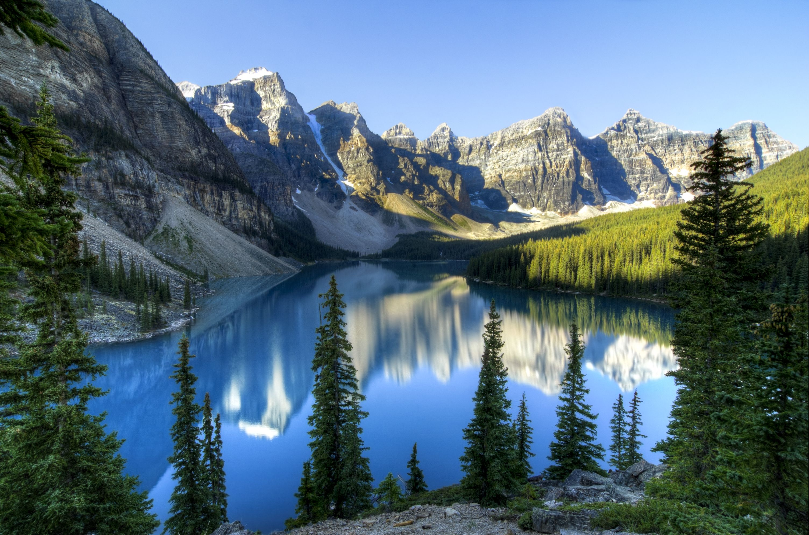

I leaned a lot from this work. I better understand the cause, the consequence and the most important what we need to do preserve the nature.

 In first, these articles present some cause from different horizon. The cause of biodiversity loss is the global warming in certain case or the pollution in other, there also the illegal trade of animals, the pesticide, ocean heating, etc…
So, there are different origin of biodiversity loss and different effect on different population. 

 This different effect on biodiversity is not the same for every species. For example, global warming caused the decrease and extinction of a specific species and also caused the increases of another. And it is the most interesting thing about this work and explain why biodiversity is more complicated than expect. This is why the scientific background with interventions of experts is important to understand this phenomenon. It is also interesting to make parallel between my course of ecology in Bac 2 and this subject.

 The different articles give also a lot of solution and actions we can make to change this situation. 

 Now, I have a better idea and comprehension of the situation. In conclusion, this work was very stimulating and enriching, I have no regrets to have taken this subject.
